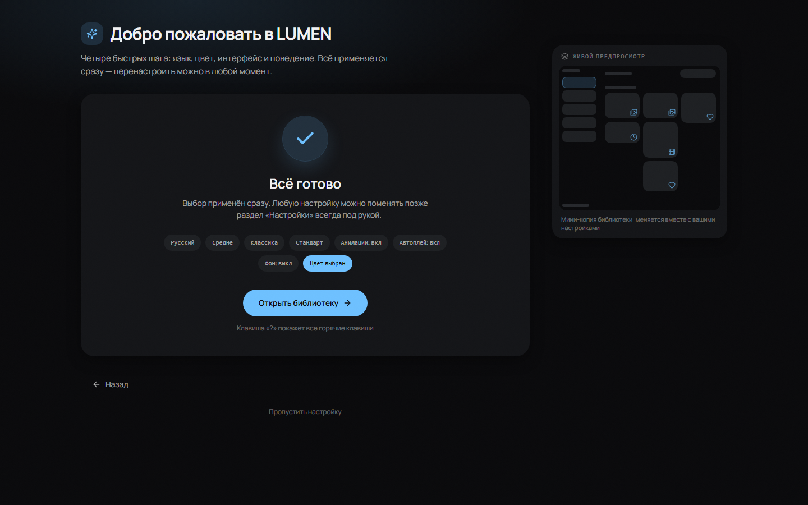

<div align="center">


# LUMEN

**An open-source photo & video gallery and image viewer for Windows.**
Local-first: your files stay where they are — no cloud, no import, no account.

[](https://github.com/Stamir36/lumen-gallery/stargazers)
[](LICENSE)
[](#getting-started)
[](https://tauri.app)
[](#tech-stack)

[English](README.md) · [Русский](README.ru.md)

</div>

---

## What it is

**LUMEN is a desktop photo gallery, video player and file browser for large
local collections** — a fast, private alternative to cloud photo apps. It points
at the folders you already have and turns them into a gallery. It indexes in the
background, renders its own thumbnails in Rust, and never moves or rewrites a
single byte of your media.

Built for one person who keeps tens of thousands of photos and videos on a
drive, and wants to browse them without waiting:

- **Instant scroll** — a virtualized grid that only renders what is on screen,
  in four layouts (justified rows, masonry, square, list).
- **Native thumbnails** — decoded in a worker pool, cached in SQLite, served
  from disk on the next launch.
- **The viewer is the app** — LUMEN registers itself as an image/video handler,
  so double-clicking a file in Explorer opens it almost instantly, even from a
  cold start.
- **Quiet by design** — no telemetry, no network calls, no browser chrome. Even
  text selection and cursors behave like a desktop app.

## Screenshots

| Library grid | Settings — personalization |
|---|---|
|  |  |

| Photo viewer | Video player |
|---|---|
|  |  |

| First-run setup | Settings |
|---|---|
|  |  |

<div align="center"></div>

## Features

### Library

- **Non-destructive indexing** — add a folder, LUMEN reads it, nothing else.
  Files that disappear are marked offline, not deleted.
- **Live watching** — new files show up as the filesystem reports them, no
  manual rescan needed.
- **Four view modes** — justified rows, masonry, uniform squares and a compact
  list, switched from the titlebar.
- **Explorer mode** — a real folder tree next to the grid, plus folder cards for
  people who think in directories.
- **Smart views** — All media, Photos, Videos, Favorites, Recents, Trash.
- **Search, sort and filters** — by name, date (shot or added), size, kind.
- **Favorites & trash** — reversible, with a selection pill that appears the
  moment you start selecting.
- **Excluded folders** — keep caches and app data out of the gallery, with an
  option to show them again chipped.
- **Density presets** — comfort / medium / compact, applied to every layout
  live.

### Viewer & playback

- **Lightbox** for photos with neighbour prefetch, staged decoding and a
  zoom/pan surface.
- **Video player** with resume positions, hover scrubbing in the grid, a
  floating glass control pill, and a custom mini-player window.
- **Color correction** (saturation + sharpness) applied globally to every video
  surface.
- **Collage** and **VR dome** surfaces for showing photos big.
- **Shuffle, swipe navigation, on-screen hotkey sheet** (`?`).

### Personalization

- **Setup wizard on first run** — language, accent, interface density, corner
  language and behavior, with a live preview of the shell.
- **Ten accent presets plus a custom HSV picker** — the whole UI repaints
  instantly.
- **Micro-animation switch, corner presets, card-hover motion** — from a still
  desktop app to a lively one, no restart.
- **Russian and English**, switchable on the fly.
- **Background (tray) mode** — off by default; when on, closing the window
  parks LUMEN in the tray so the next launch is instant.

## Tech stack

| Layer | Choice |
|---|---|
| Shell | [Tauri v2](https://tauri.app) (WebView2, single instance, deep-link file args) |
| Frontend | React 18 · TypeScript · Vite 6 · Tailwind v4 · Framer Motion · Zustand · TanStack Query |
| Backend | Rust · SQLite (`sqlx` through `tauri-plugin-sql`) · `notify` file watching · a dedicated `image`/`ffmpeg`-free thumbnail engine |
| Tests | Playwright — functional walkthroughs plus pixel baselines |

Everything runs locally. LUMEN makes no network requests except the ones you ask
for (opening a link, or an external player).

## Getting started

**Prerequisites**

- Node.js 20+ and [pnpm](https://pnpm.io)
- Rust stable (1.77.2+)
- Windows 10/11 with the WebView2 runtime (preinstalled on current Windows)

```bash
git clone https://github.com/Stamir36/lumen-gallery.git
cd lumen
pnpm install

pnpm tauri dev      # run with hot reload
pnpm tauri build    # build the release exe + NSIS installer
```

On Windows you can also just double-click **`dev.bat`** (dev mode) or
**`build.bat`** (release build, then opens the output folder).

> If `dev.bat` reports a port error, another Vite instance is already holding
> `1420` — close it and run again (`strictPort` is intentional: the app must
> never silently attach to the wrong dev server).

## Project layout

```
src/                  React app
  components/library/   grid, sidebar, folder surfaces
  components/viewer/    lightbox, video player, filmstrip, VR, collage
  components/settings/  settings primitives + panels
  lib/                  queries, thumbnails, settings store, formatting
  pages/                settings, onboarding, setup wizard, QA routes
  state/                zustand stores (library UI, viewer, context menu)
src-tauri/src/        Rust backend
  scan.rs watch.rs      indexing + filesystem watching
  thumbs.rs writer.rs   thumbnail engine, single-writer DB task
  media_server.rs       loopback CORS server for the VR dome
  tray.rs assoc.rs      background mode, file associations
e2e/                  Playwright specs + pixel baselines
docs/                 DESIGN.md, SPEC.md, audits
```

## Development notes

```bash
pnpm typecheck        # tsc --noEmit
pnpm build            # typecheck + production bundle
pnpm e2e              # Playwright suite
pnpm e2e:update       # (re)record pixel baselines — they are machine-specific
(cd src-tauri && cargo clippy --all-targets)
```

Pixel baselines are **not** committed: fonts and GPU rasterization differ per
machine. Record them once locally with `pnpm e2e:update`.

Hidden QA routes (work in a plain browser, no Tauri needed): `#/grid-demo`
(synthetic grid), `#/style` (living style sheet), `#/settings`,
`#/onboarding`, `#/setup`.

**Where your data lives**

- Database: `%APPDATA%\com.unesell.lumen\lumen.db`
- Thumbnails, logs: `%LOCALAPPDATA%\com.unesell.lumen\`
- Your media: exactly where it was — LUMEN only reads it.

## Roadmap

See [TODO.md](TODO.md) for the detailed, commit-level roadmap. Currently open:
context-menu keyboard navigation, an "On this day" shelf, list-view metadata
columns, and the acceptance numbers for large libraries.

## Contributing

Issues and pull requests are welcome — see [CONTRIBUTING.md](CONTRIBUTING.md).
Bug reports get much easier to fix with: your Windows version, the library size,
and the last lines of `%LOCALAPPDATA%\com.unesell.lumen\logs\LUMEN.log`.

## License

**GPL-3.0** — see [LICENSE](LICENSE). You may use, study, modify and share
LUMEN, but any distributed derivative must stay open under the same license and
must keep the copyright notices. Forking and improving it is welcome; taking it,
closing it up and presenting it as your own is not.

The **LUMEN** name and logo are not covered by the license and may not be used
for derived distributions without permission.

---

<div align="center">

Made by **Stanislav Miroshnichenko** · [Unesell Studio](https://github.com/Stamir36)

</div>
