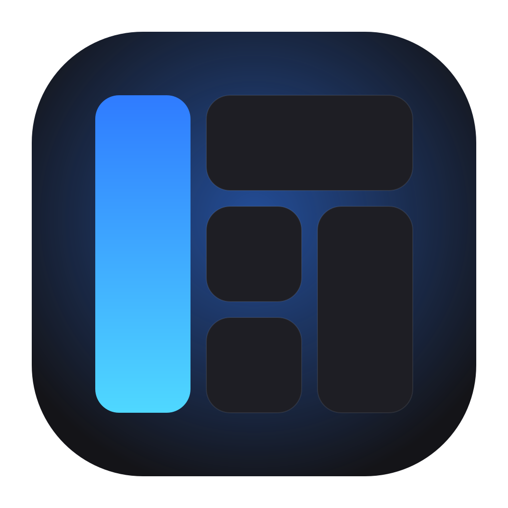
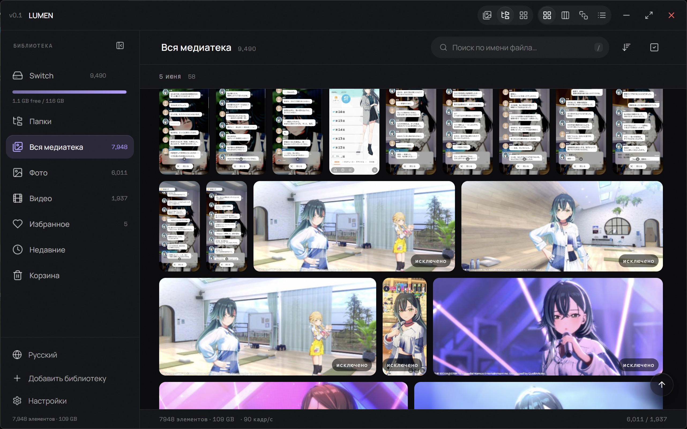
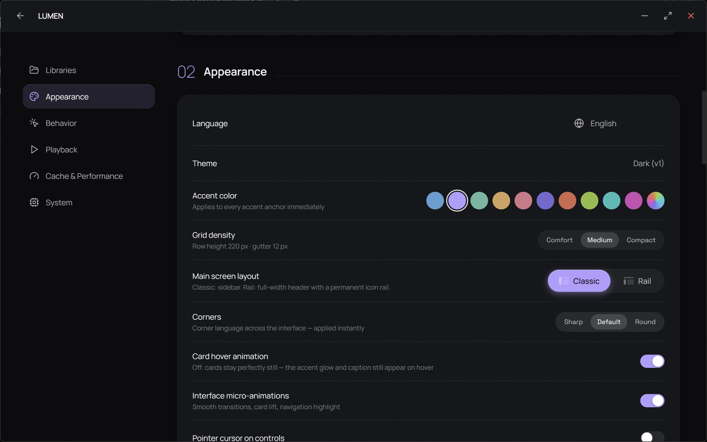
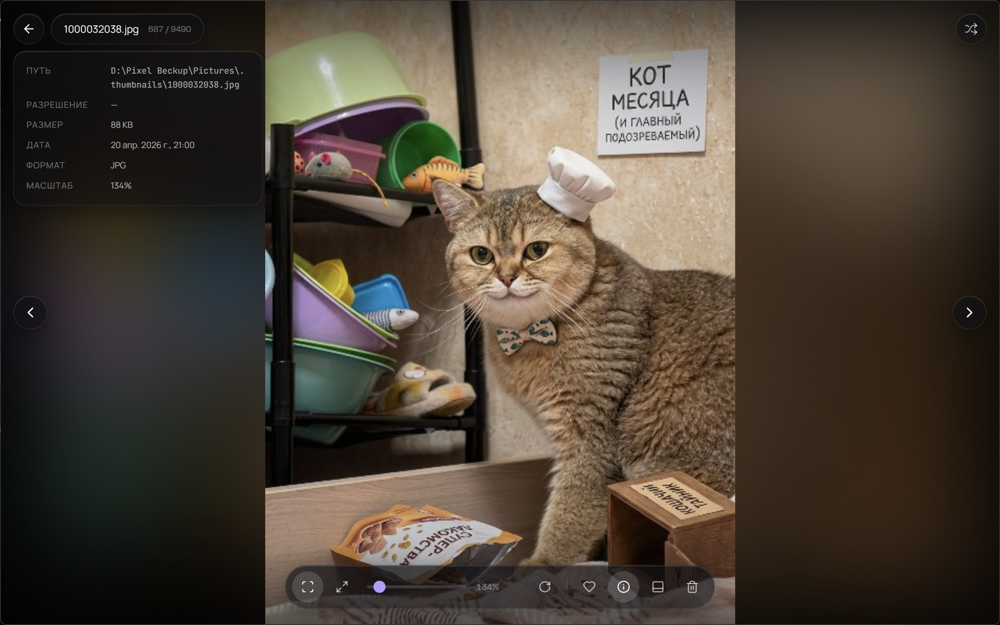
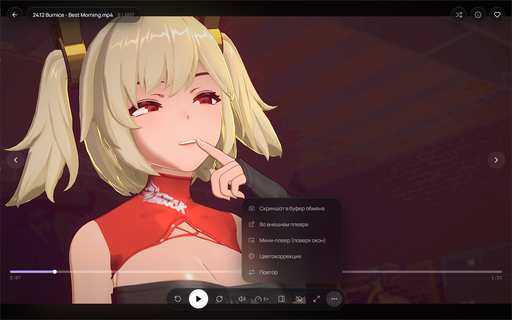
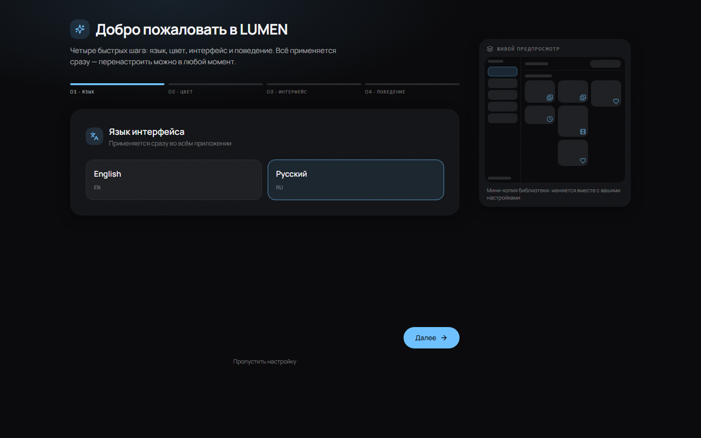
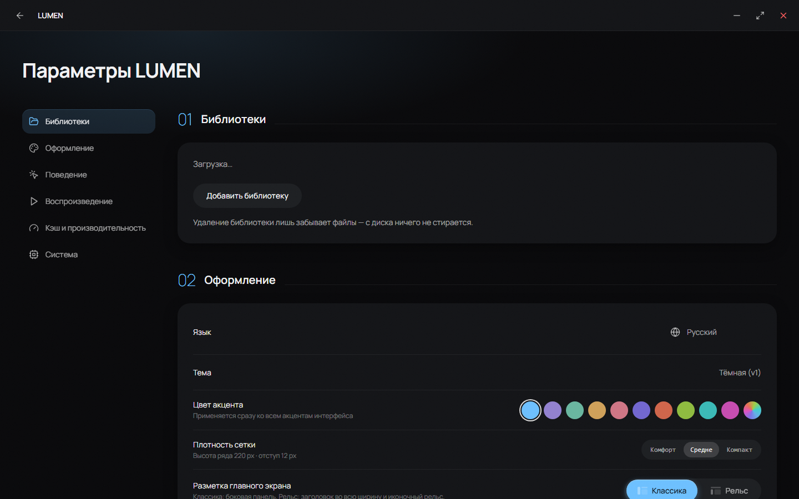

<div align="center">



# LUMEN

**Открытая галерея фото и видео и просмотрщик изображений для Windows.**
Всё локально: файлы остаются там, где лежат — без облака, импорта и аккаунтов.

[](https://github.com/Stamir36/lumen-gallery/stargazers)
[](LICENSE)
[](#быстрый-старт)
[](https://tauri.app)
[](#технологии)
[](https://stamir36.github.io/lumen-gallery/ru/)

[English](README.md) · **Русский** · [Сайт](https://stamir36.github.io/lumen-gallery/ru/) · [Политика конфиденциальности](https://stamir36.github.io/lumen-gallery/ru/privacy/)

</div>

---

## Что это

**LUMEN — настольная галерея фотографий, плеер видео и просмотрщик файлов для
больших локальных коллекций** — быстрая и приватная альтернатива облачным
приложениям для фото. LUMEN подключается к папкам, которые у вас уже есть, и
превращает их в галерею. Индексация идёт в фоне, превью рисует Rust, и ни один
байт ваших файлов не переписывается и не перемещается.

Приложение сделано для человека, у которого десятки тысяч фото и видео на
диске, и который хочет их просто смотреть — без ожидания:

- **Мгновенная прокрутка** — виртуализированная сетка рендерит только то, что
  на экране, в четырёх раскладках (justified-строки, masonry, квадраты, список).
- **Нативные превью** — декодирование в пуле воркеров, кэш в SQLite, на
  следующем запуске всё уже готово.
- **Просмотрщик — и есть приложение** — LUMEN регистрируется как обработчик
  изображений и видео, поэтому двойной клик по файлу в Проводнике открывает его
  почти сразу, даже на холодном старте.
- **Тишина по дизайну** — ни телеметрии, ни сетевых запросов, ни браузерного
  хрома. Даже выделение текста и курсоры ведут себя как в настольной программе.

## Скриншоты

| Сетка библиотеки | Настройки — персонализация |
|---|---|
|  |  |

| Просмотр фото | Видеоплеер |
|---|---|
|  |  |

| Первоначальная настройка | Настройки |
|---|---|
|  |  |

## Возможности

### Библиотека

- **Индексация без изменений** — добавляете папку, LUMEN её читает, и только.
  Пропавшие файлы помечаются как offline, а не удаляются.
- **Живое слежение** — новые файлы появляются сразу, вручную пересканировать не
  нужно.
- **Четыре режима просмотра** — justified-строки, masonry, одинаковые квадраты
  и компактный список; переключаются в заголовке окна.
- **Режим проводника** — настоящее дерево папок рядом с сеткой плюс карточки
  папок для тех, кто мыслит директориями.
- **Умные виды** — вся медиатека, фото, видео, избранное, недавние, корзина.
- **Поиск, сортировка и фильтры** — по имени, дате (съёмки или добавления),
  размеру, типу.
- **Избранное и корзина** — обратимо, с панелью выбора, которая появляется
  сразу, как только вы начали выбирать.
- **Исключённые папки** — кэши и служебные данные не попадают в галерею, при
  желании их можно снова показать с пометкой.
- **Плотность сетки** — комфорт / обычная / плотная, применяется ко всем
  раскладкам сразу.

### Просмотр и плеер

- **Лайтбокс** для фото с предзагрузкой соседних кадров, поэтапным декодированием
  и поверхностью для зума.
- **Видеоплеер** с продолжением с места остановки, превью-прокруткой прямо в
  сетке, плавающей стеклянной панелью управления и отдельным мини-плеером.
- **Коррекция цвета** (насыщенность и резкость) для всех видеоповерхностей.
- **Коллаж** и **VR-купол** для большого показа фотографий.
- **Перемешивание, листание свайпом, шпаргалка по горячим клавишам** (`?`).

### Персонализация

- **Мастер первоначальной настройки** — язык, акцент, плотность интерфейса,
  скругления и поведение, с живым предпросмотром оболочки.
- **Десять акцентов плюс свой HSV-пикер** — интерфейс перекрашивается мгновенно.
- **Переключатель микро-анимаций, пресеты скруглений, анимация карточек** — от
  полностью статичного вида до живого, без перезапуска.
- **Русский и английский**, переключаются на лету.
- **Фоновый режим (трей)** — по умолчанию выключен; когда включён, крестик
  прячет LUMEN в трей, и следующий запуск мгновенный.

## Технологии

| Слой | Что используется |
|---|---|
| Оболочка | [Tauri v2](https://tauri.app) (WebView2, single instance, аргумент-файл при запуске) |
| Фронтенд | React 18 · TypeScript · Vite 6 · Tailwind v4 · Framer Motion · Zustand · TanStack Query |
| Бэкенд | Rust · SQLite (`sqlx` через `tauri-plugin-sql`) · слежение за файлами `notify` · собственный движок превью |
| Тесты | Playwright — функциональные сценарии плюс пиксельные базлайны |

Всё работает локально. LUMEN не делает сетевых запросов, кроме тех, о которых вы
попросили сами (открыть ссылку или внешний плеер).

## Быстрый старт

**Что нужно**

- Node.js 20+ и [pnpm](https://pnpm.io)
- Rust stable (1.77.2+)
- Windows 10/11 с рантаймом WebView2 (в актуальной Windows он уже есть)

```bash
git clone https://github.com/Stamir36/lumen-gallery.git
cd lumen-gallery
pnpm install

pnpm tauri dev      # запуск с горячей перезагрузкой
pnpm tauri build    # релизный exe + NSIS-установщик
```

На Windows можно просто дважды щёлкнуть **`dev.bat`** (режим разработки) или
**`build.bat`** (релизная сборка с открытием папки с результатом).

> Если `dev.bat` пишет про занятый порт — значит, другой экземпляр Vite уже
> держит `1420`. Закройте его и запустите снова (`strictPort` включён специально:
> приложение не должно молча подключиться не к тому дев-серверу).

## Структура проекта

```
src/                  React-приложение
  components/library/   сетка, сайдбар, папки
  components/viewer/    лайтбокс, плеер, лента кадров, VR, коллаж
  components/settings/  примитивы и разделы настроек
  lib/                  запросы, превью, стор настроек, форматирование
  pages/                настройки, онбординг, мастер настройки, QA-маршруты
  state/                zustand-сторы (UI библиотеки, просмотрщик, меню)
src-tauri/src/        Rust-бэкенд
  scan.rs watch.rs      индексация и слежение за файлами
  thumbs.rs writer.rs   движок превью, задача единственного писателя в БД
  media_server.rs       локальный CORS-сервер для VR-купола
  tray.rs assoc.rs      фоновый режим, ассоциации файлов
e2e/                  спеки Playwright + пиксельные базлайны
docs/                 DESIGN.md, SPEC.md, аудиты
```

## Разработка

```bash
pnpm typecheck        # tsc --noEmit
pnpm build            # проверка типов + продакшн-сборка
pnpm e2e              # набор Playwright
pnpm e2e:update       # перезапись базлайнов — они зависят от машины
pnpm site             # локальный показ страницы из site/ на localhost:4173
(cd src-tauri && cargo clippy --all-targets)
```

Пиксельные базлайны **не коммитятся**: шрифты и растеризация GPU на разных
машинах отличаются. Запишите их один раз локально: `pnpm e2e:update`.

Скрытые QA-маршруты (работают в обычном браузере, без Tauri): `#/grid-demo`
(синтетическая сетка), `#/style` (живой стайл-лист), `#/settings`,
`#/onboarding`, `#/setup`.

**Где лежат данные**

- База: `%APPDATA%\com.unesell.lumen\lumen.db`
- Превью и логи: `%LOCALAPPDATA%\com.unesell.lumen\`
- Ваши файлы: там же, где были — LUMEN их только читает.

## Сайт проекта

Страница проекта и политика конфиденциальности лежат в [`site/`](site/) как
обычный статический HTML без сборки и публикуются на GitHub Pages workflow'ом
[`.github/workflows/pages.yml`](.github/workflows/pages.yml):

- <https://stamir36.github.io/lumen-gallery/> — английская версия
- <https://stamir36.github.io/lumen-gallery/ru/> — русская версия
- <https://stamir36.github.io/lumen-gallery/ru/privacy/> — политика конфиденциальности

Посмотреть локально: `pnpm site`. Как развернуть и как получается адрес — в
[docs/WEBSITE.md](docs/WEBSITE.md); публикация в Microsoft Store — в
[docs/MICROSOFT-STORE.md](docs/MICROSOFT-STORE.md).

## План развития

Подробный план по коммитам — в [TODO.md](TODO.md). Сейчас открыто: навигация по
контекстному меню с клавиатуры, полка «В этот день», колонки метаданных в
списке и замеры производительности на больших библиотеках.

## Участие в проекте

Issues и pull request'ы приветствуются — см. [CONTRIBUTING.md](CONTRIBUTING.md).
Баг починить заметно проще, если приложить: версию Windows, размер библиотеки и
последние строки из `%LOCALAPPDATA%\com.unesell.lumen\logs\LUMEN.log`.

## Лицензия

**GPL-3.0** — см. [LICENSE](LICENSE). LUMEN можно использовать, изучать,
изменять и распространять, но любая распространяемая производная версия обязана
остаться открытой под той же лицензией и сохранить упоминание авторства.
Форкать и улучшать — пожалуйста; брать целиком, закрывать и выдавать за своё —
нельзя.

Название и логотип **LUMEN** лицензией не покрываются и не могут использоваться
в производных сборках без разрешения.

---

<div align="center">

Сделано **Станиславом Мирошниченко** · [Unesell Studio](https://github.com/Stamir36)

</div>
